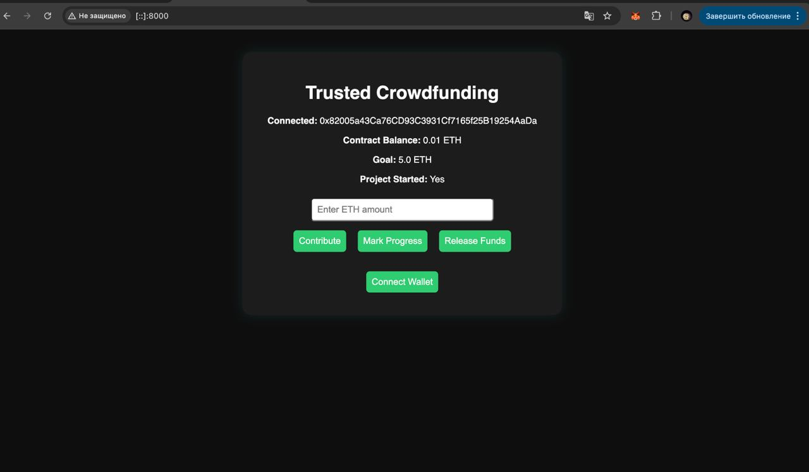

This README provides comprehensive guidance for the **blockchain-final** project, a decentralized crowdfunding application built on Ethereum. It outlines the project’s purpose, core features, technology stack, installation steps, usage instructions, project structure, testing approach, and contribution guidelines to help developers get started quickly and collaborate effectively.

## Table of Contents

* [Project Overview](#project-overview)
* [Features](#features)
* [Technology Stack](#technology-stack)
* [Installation](#installation)
* [Usage](#usage)
* [Project Structure](#project-structure)
* [Testing](#testing)
* [Contributing](#contributing)
* [License](#license)

## Project Overview

The **blockchain-final** repository hosts a decentralized crowdfunding dApp that allows users to create campaigns, contribute funds, and withdraw collected amounts upon reaching funding goals. Smart contracts are implemented in **Solidity**, an object-oriented, high-level language for writing Ethereum contracts  The development environment is powered by **Hardhat**, a robust task runner for compiling, testing, and deploying smart contracts  On the client side, the front end is built with **React**, a component-based UI library maintained by Meta . Blockchain interactions are facilitated by **ethers.js**, a compact JavaScript library for communicating with Ethereum nodes

## Features

This project delivers a full-stack decentralized application featuring:

* **Campaign Management**: Users can launch new crowdfunding campaigns by specifying a funding goal and deadline.
* **Contributions**: Supporters contribute ether to active campaigns, with real-time balance updates.
* **Payouts**: Once a campaign reaches its goal, the campaign owner can withdraw funds.
* **Refunds**: If the funding goal is not met by the deadline, contributors can claim refunds.
* **User Interface**: A responsive React UI provides intuitive forms and displays for campaign data and transaction statuses.

## Technology Stack

The project leverages the following technologies:

* **Node.js & npm**: JavaScript runtime and package manager for running scripts and managing dependencies 
* **Hardhat**: Ethereum development environment offering compilation, testing, and local blockchain simulation
* **Solidity**: Smart contract language targeting the Ethereum Virtual Machine 
* **ethers.js**: Library for interacting with Ethereum, handling wallets, providers, and contract abstractions
* **React**: Front-end library for building interactive user interfaces with reusable components 
* **OpenZeppelin Contracts** : Standardized and secure implementations of common contract patterns

## Installation

1. **Clone the repository**

   ```bash
   git clone https://github.com/gemdivk/blockchain-final.git
   cd blockchain-final
   ```
2. **Install root dependencies**

   ```bash
   npm install
   ```
3. **Install front-end dependencies**

   ```bash
   cd crowdfunding-ui
   npm install
   ```

## Usage

### 1. Compile and Deploy Contracts

From the project root:

```bash
npx hardhat compile
npx hardhat run scripts/deploy.js --network localhost
```

This compiles the Solidity contracts and deploys them to a local Hardhat network.

### 2. Run Local Blockchain

```bash
npx hardhat node
```

Keeps a local Ethereum node running for testing deployments and interactions.

### 3. Start Front-End

In a separate terminal:

```bash
cd crowdfunding-ui
npm start
```

Opens the React application at `http://localhost:3000` to interact with deployed contracts.

## Project Structure

```
.
├── artifacts/           # Compiled contract artifacts
├── cache/               # Hardhat cache files
├── contracts/           # Solidity contract source files
├── crowdfunding-ui/     # React front-end application
├── scripts/             # Deployment and utility scripts
├── src/                 # Hardhat tests and scripts
├── test/                # JavaScript/TypeScript tests for contracts
├── hardhat.config.js    # Hardhat configuration
└── package.json         # Project metadata and dependencies
```

## Testing

Execute the contract test suite using Hardhat’s built-in runner:

```bash
npx hardhat test
```

Tests validate core functionality of contract flows (campaign creation, funding, withdrawals, refunds) ([hardhat.org][17]).

## Screenshots (Proof)

| Sceenshot | Path | Description |
|-|-|-|
| Deploy | | Deployment into the blockchain and creation of the server |
| Tests  |  | Passing all the initial tests to ensure web3 app will work properly |
| Donate |  | Donation functionality working properly |
| Project Start |  | Project Start functionality working properly |
| End result |  | How the site looks after performing all actions |

## Contributing

Contributions are welcome! Please follow these steps:

1. Fork the repository and create a feature branch (`git checkout -b feature/YourFeature`).
2. Commit your changes (`git commit -am 'Add YourFeature'`).
3. Push to the branch (`git push origin feature/YourFeature`).
4. Open a pull request detailing your changes and rationale.

Ensure all tests pass locally before submitting a PR.

## License

This project is released under the MIT License. See the [LICENSE](LICENSE) file for details.